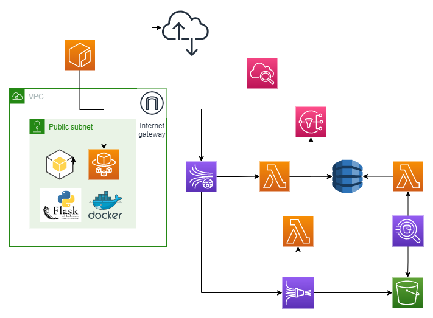
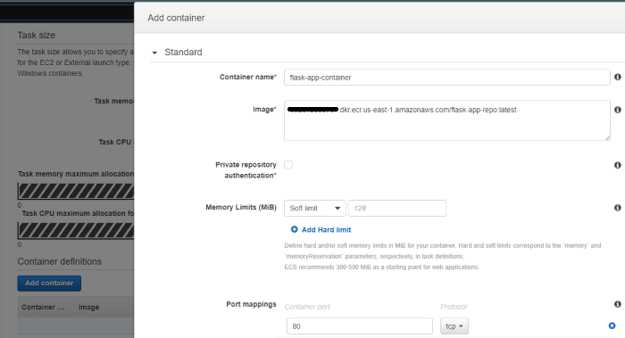
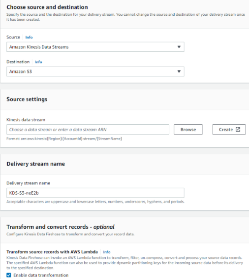
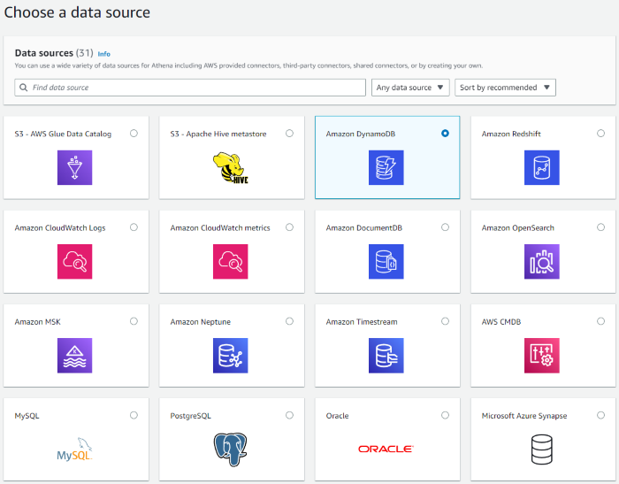

# AWS Arquitecture

## Introducción

El proyecto consiste en una aplicación web programada en Python y el framework web Flask, mediante la cual
por medio de una interfaz de usuario (formulario) se generan datos en tiempo real que son captados y procesados por el servicio AWS Kinesis Data Stream.

Los datos persisten en una base de datos NoSQL DynamoDB mediante arquitectura serverless basada en funciones Lambda.

Se utiliza Kinesis Firehose Delivery Stream como ETL serverless entre Kinesis Data Stream y S3 (persistencia en archivo).

Se utiliza el servicio Athena para consultas SQL a la base datos y almacenamiento en S3 en formato csv. 

El despliegue de la aplicación se lleva a cabo mediante el servicio ECS fargate (cluster de contenedores serverless) corriendo en una subnet pública de la VPC.

Se configura el servicio SNS para alertas por mail.



## Video demostración

https://drive.google.com/file/d/1rHR2tfdoTiD6L5SeRUSOBK4obLnUWmIm/view?usp=share_link

## Pricing

https://calculator.aws/#/estimate?nc2=pr&id=2cd5e27784cd0c582f7a5b61fc11e696faffb20a

## Aplicación

Se configura un server con la ruta "/load" en la cual la petición GET renderiza un formulario con un botón. El método POST genera una serie de 20 objetos con propiedad id, fecha de creación y producto (random sobre una lista), que son enviados a Kinesis mediante el método "put_record" del cliente boto3.

## Despliegue en ECR y ECS

Se crea un repositorio privado en ECR.

Luego, ubicados en el directorio del Dockerfile, se aplican los comandos para subir la imagen (view push commands en la consola de AWS).

Se autoriza el cliente de Docker para acceder al repositorio: 

aws ecr get-login-password --region us-east-1 | docker login --username AWS --password-stdin XXXXX.dkr.ecr.us-east-1.amazonaws.com

Se realiza el build:

docker build -t flask-app-repo .

Se tagea la imagen:

docker tag flask-app-repo:latest XXXXX.dkr.ecr.us-east-1.amazonaws.com/flask-app-repo:latest

Se pushea la imagen:

docker push XXXXX.dkr.ecr.us-east-1.amazonaws.com/flask-app-repo:latest

Luego pasamos a ECS. 

Se crea un cluster de tipo "Networking only" y una VPC en caso de no tener una previamente configurada.

Se crea un Task Definition de tipo Fargate (Serverless). Se selecciona el rol ecsTaskExecutionRole. 

Task memory (GB): 1GB

Task CPU: 0.5 vCPU



Una vez creado el Task definition, volver a Clusters y elegir Run Task. Se debe configurar:

Launch type: Fargate

Task Definition: elegir el creado anteriormente

Cluster: aparece el creado anteriormente

Number of tasks: 1 o más

Cluster VPC, Subnets y Security Groups (previamente creados)

Una vez que el contenedor esté corriendo, se disponiniliza la IP pública a través de la cual nos conectamos a las rutas de la aplicación web.

## Kinesis Data Stream

Se crea un Data Stream provisionado con 1 shard, ya que en este caso el volumen de datos es predecible y conocido.

## Dynamo DB

Se crea una tabla, en este caso con Default Settings y el id como Partition Key.

## Lambda

La función recibe los datos del Stream, los decodifica (ya que vienen en base64), los parsea y los carga en la tabla de DynamoDB (mediante un Context Manager para asegurar el cierre
de la conexión).

```python
decoded_record_data = [base64.b64decode(record['kinesis']['data']) for record in event['Records']]
deserialized_data = [json.loads(decoded_record) for decoded_record in decoded_record_data]

with table.batch_writer() as batch_writer:
   for item in deserialized_data:
      batch_writer.put_item(Item={'id_producto': item['id_producto'], 'fecha_reg': item['fecha_reg'], 'producto': item['producto']})
```

Se edita el role de la función Lambda para que tenga los permisos necesarios:

- Generar logs en CloudWatch.

- Obtener los datos de Kinesis Data Streams.

- Almacenar los datos en DynamoDB.

- Enviar mensajes por SNS.

```json
{
    "Version": "2012-10-17",
    "Statement": [
        {
            "Sid": "VisualEditor0",
            "Effect": "Allow",
            "Action": [
                "logs:CreateLogStream",
                "logs:PutLogEvents",
		        "logs:CreateLogGroup"
            ],
            "Resource": "*"
        },
        {
            "Sid": "VisualEditor1",
            "Effect": "Allow",
            "Action": [
		        "kinesis:DescribeStream",
                "kinesis:GetShardIterator",
		        "kinesis:GetRecords",
                "dynamodb:BatchWriteItem",
                "dynamodb:PutItem",
		        "sns:Publish"
            ],
            "Resource": "*"
        }
    ]
}

```

## SNS 

Se crea un topic con una suscripción a una dirección de mail, creando una alerta en caso de que la función lambda reciba determinado valor.    

## S3 

Se crea un bucket en el cual persisten los datos provenientes de los pipelines que se explican a continuación.

## Kinesis Firehose

Es un servicio ETL que captura, transforma y entrega de manera fiable datos de streaming en data lakes, en este caso un bucket de S3.

Se crea un Delivery Stream tomando como fuente el Data Stream y como destino el bucket previamente creado.



La función lambda para esta operación se toma de un blueprint, y a diferencia de la anterior, no se configura el trigger.

Los datos se almacenan en el bucket en formato de archivo con una estructura de directorios en base a la fecha de creación.

## Athena

Se crea un Data Source Connector, que permitirá a Amazon Athena comunicarse con DynamoDB, de manera de acceder a la tabla de Dynamo mediante consultas SQL.



La conexión se establece mediante una función lambda, en la cual se configura un spill bucket para almacenar los datos en caso de que se exceda el tamaño límite de respuesta de la función. Las consultas SQL persisten en el bucket en formato csv.

## Conclusiones

Se desarrolló una arquitectura completamente serverless (despliegue, persistencia y acceso a los datos).